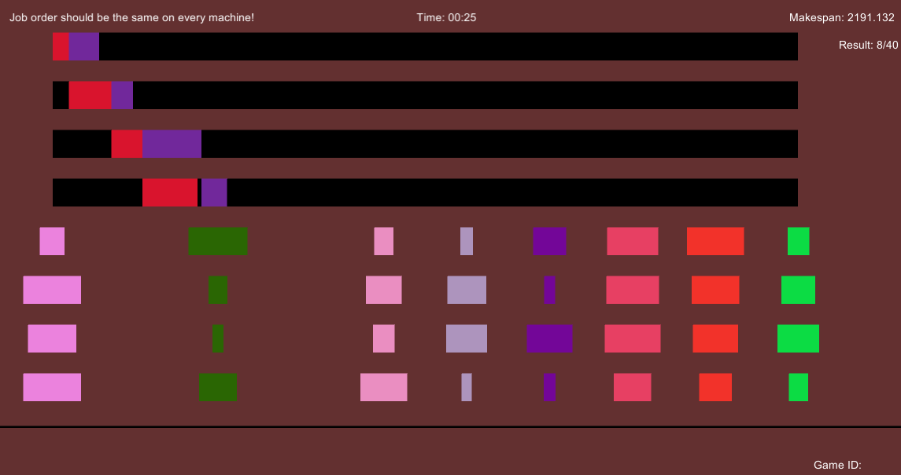

# flow-shop-scheduling-iml

Conference Paper - Interactive Machine Learning Approach to Permutation Flow Shop Scheduling Problem.

Paper: not yet available

# Code

This repository contains code for backend server (Python), video game (Unity - C#) and interactive MMAS algorithm (Python).

Gameplay of the video game:

